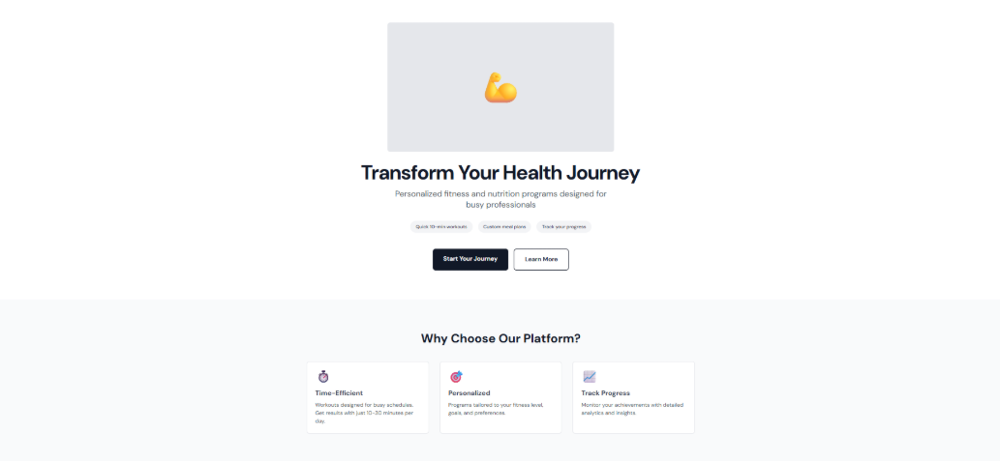
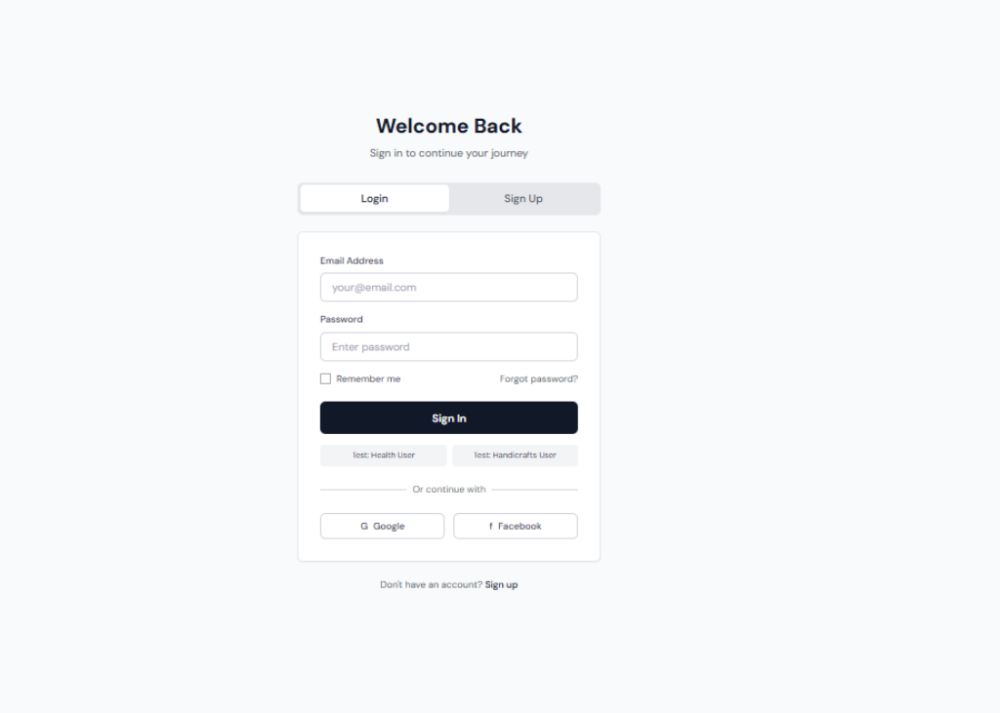

# UI-UX-Experiment5

## Aim:

To study and design two UX project scenarios — a Health & Fitness Mobile App and an E-Commerce Website for Local Handicrafts — by identifying problem statements, selecting research methods, and creating user personas for better user-centered design.

## Algorithm:

1. Identify the UX project scenario (e.g., health app or e-commerce site).

2. Collect and analyze user pain points related to the chosen scenario.

3. Write 1–2 problem statements using the format: “[User] needs a way to [achieve goal] because [obstacle], which results in [impact].”

4. Choose suitable UX research methods like surveys, interviews, or usability testing.

5. Justify the selected research methods based on project needs and data goals.

6. Gather data from users through the chosen methods to understand behaviors and needs.

7. Create user personas that include demographics, goals, behaviors, pain points, and motivations.

8. Document all findings to support the UX design and usability improvements.

## Output:

## Result:

Two UX project scenarios were successfully designed — a Health & Fitness App and a Handicraft E-Commerce Platform — with clear problem statements, justified research methods, and detailed user personas created for each.